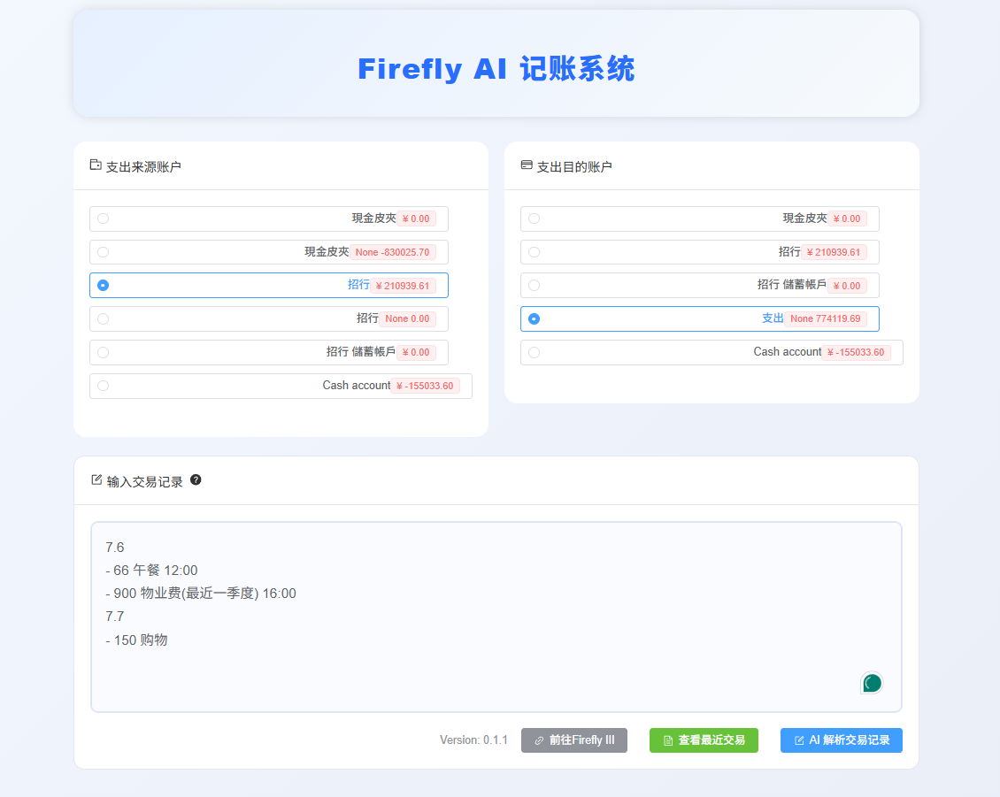
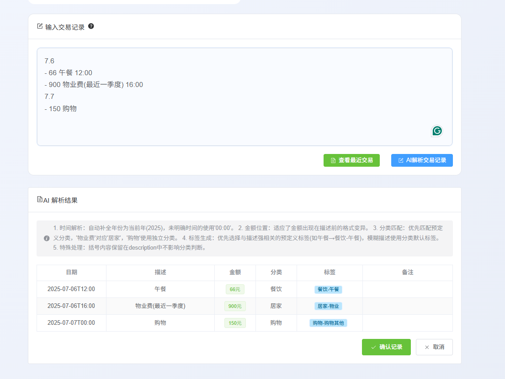
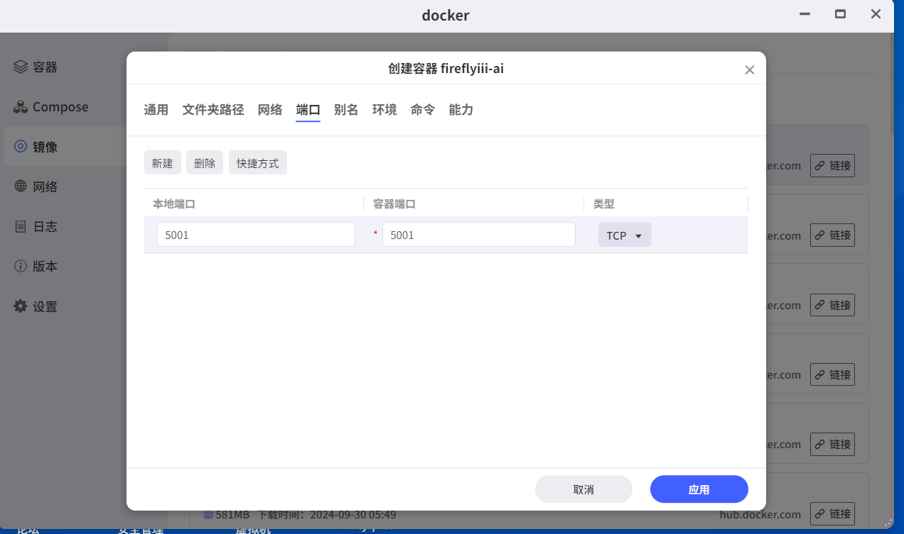
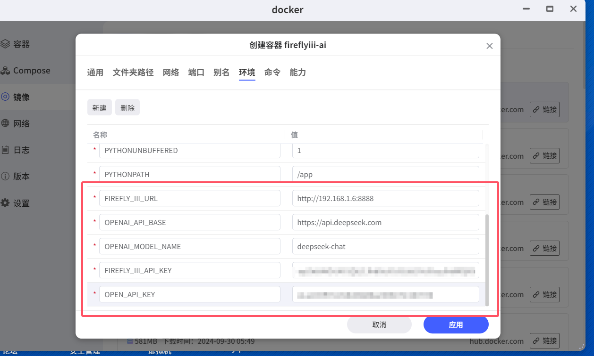

# Fireflyiii-AI-Recorder AI记账系统
AI bookkeeping based Fireflyiii openapi. Parses natural language spending and auto-creates transactions
使用Fireflyiii的记账系统的openapi。实现智能AI记账。
用户只需要输入简单的描述，AI会自动识别并生成记账内容。


## 前提条件
使用本系统前，请确保满足以下条件：
1. 已部署开源Fireflyiii，登录系统并获取其OpenAPI访问地址和访问令牌
2. 已申请DeepSeek的API Key（可前往[DeepSeek官网](https://platform.deepseek.com/)申请）


## 功能描述
本系统基于Fireflyiii的OpenAPI，结合LangChain和DeepSeek大模型，实现自然语言驱动的批量记账的AI智能体。核心能力包括：
- 智能解析自然语言描述的消费记录
- 自动识别金额、消费类别和时间信息
- 批量创建Fireflyiii交易记录

## 使用方法
输入文本格式规范：
1. 每行以日期开头（格式：月.日）
2. 日期行下方为当天的消费记录
3. 每条记录以"-"开头，格式：`金额 描述 (可选时间)`

示例：
```
7.6
- 66 午餐 12:00
- 900 物业费(最近一季度) 16:00
7.7
- 150 购物
```

## 项目部署
### 本地运行
1. 确保Python版本>=3.10
2. 安装依赖：`pip install -r requirements.txt`
3. 复制`.env.example`为`.env`，并按格式填写配置信息
4. 运行程序：`python client.py`
front目为前端，如果前端有更新，执行
```bash
cd front && npm run build-only && cd .. && rm -rf static/* && cp -r front/dist/* static/
```

### 容器部署
1. 构建容器镜像：
   ```bash
   docker build -t fireflyiii-ai-recorder .
   ```
2. 运行容器时映射5001端口：`docker run -p 5001:5001 fireflyiii-ai`
3. 配置方式（二选一）：
   - 设置环境变量：使用`-e`参数传递`.env.example`中的配置项（注意：每个变量都需要单独设置），例如：
     ```bash
     docker run -p 5001:5001 \
       -e FIREFLY_III_URL=你的Firefly III实例地址 \
       -e FIREFLY_III_API_KEY=你的Firefly III API密钥 \
       -e OPENAI_API_BASE=你的OpenAI兼容API地址 \
       -e OPENAI_API_KEY=你的OpenAI API密钥 \
       -e OPENAI_MODEL_NAME=使用的模型名称 \
       fireflyiii-ai
     ```
   - 挂载配置文件：`-v /本地路径/.env:/app/.env`
### NAS部署（以极空间为例）
- 1. 在NAS上创建一个新的Docker镜像，选择`fireflyiii-ai`镜像。
- 2、映射5001端口到NAS的5001端口。 

- 3、配置环境变量
主要配置Firefly III的地址和API密钥，以及OpenAI兼容API的地址和密钥。


## 联系作者
如有任何问题或建议，欢迎通过公众号**一颗程序树**联系作者，或在GitHub上提交issue。